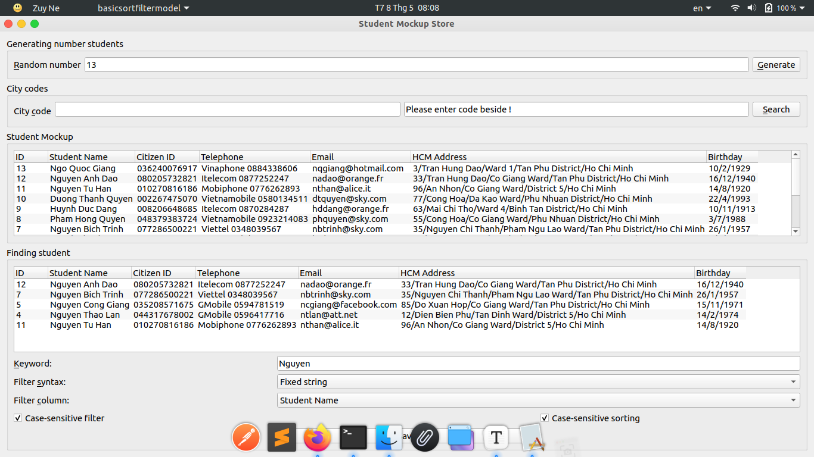

[TOC]

# Student Data Mock Project

Application for mocking student data built by C++

## About the project

- The project can generate data about student such as Student ID, Student Name, Citizen ID, Telephone, Email, Address, Birthday, ...
- Use Qt Creator to make GUI C++

### API docs

Project has not use APIs.

### Design

Qt Creator 5.14.2 (doc.qt.io)

<h3>Status</h3>

Has not dev future =)))) because this's just a project exercises in my college

<h2>Getting started</h2>

Below is my describe project and how to run itttt

#### Structure

<h4>How to use</h4>

On Linux, you can go to Release/Linux and run sudo ./MockStore.

On Windows, just double click DataMock.exe

